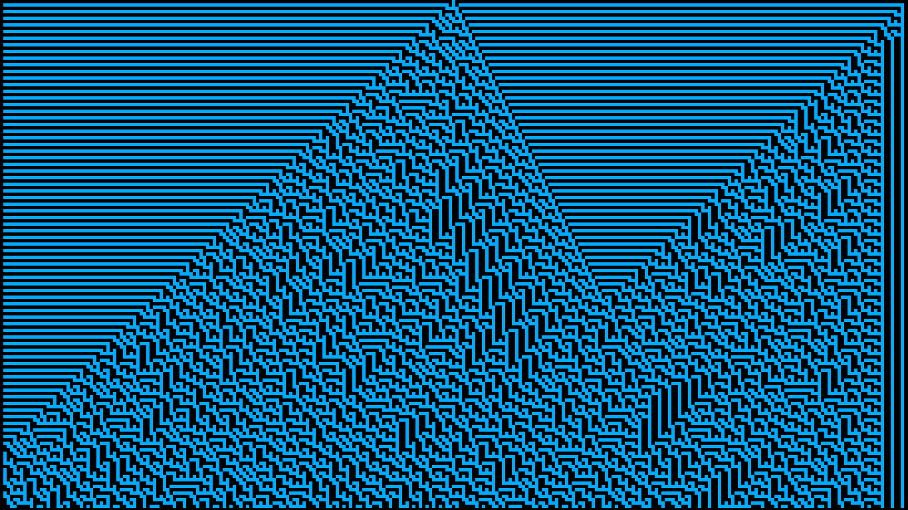
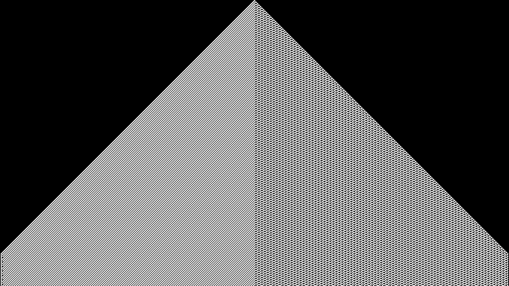

# Python Wolfram Cellular Automaton
A simple implementation of Wolfram's elementary cellular automaton in Python.

## Introduction

Wolfram's elementary cellular automaton is a simple yet powerful computational model that demonstrates complex patterns emerging from simple rules. This Python project allows you to experiment with different rulesets, visualize the automaton's evolution, and explore various patterns.

## Features

- Generate and visualize patterns using different rulesets.
- Adjustable grid size and initial configurations.
- Slow-drawing for observing automaton evolution.

